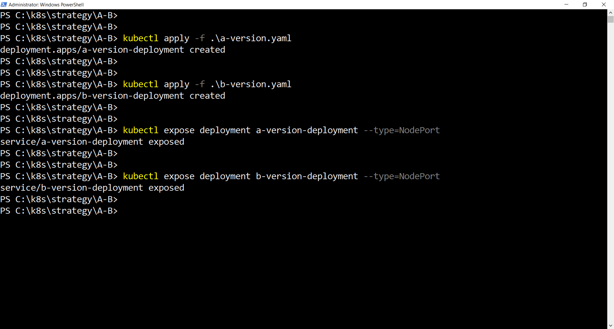
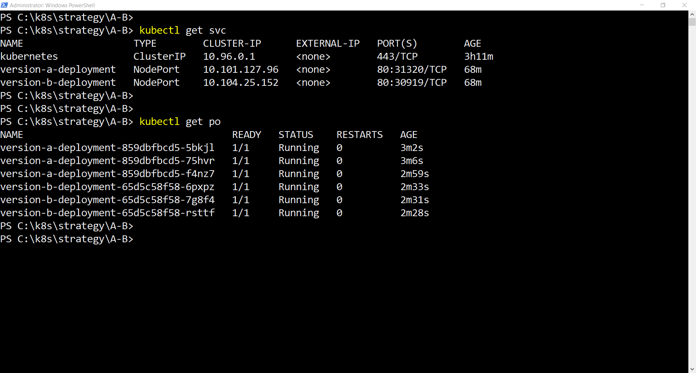
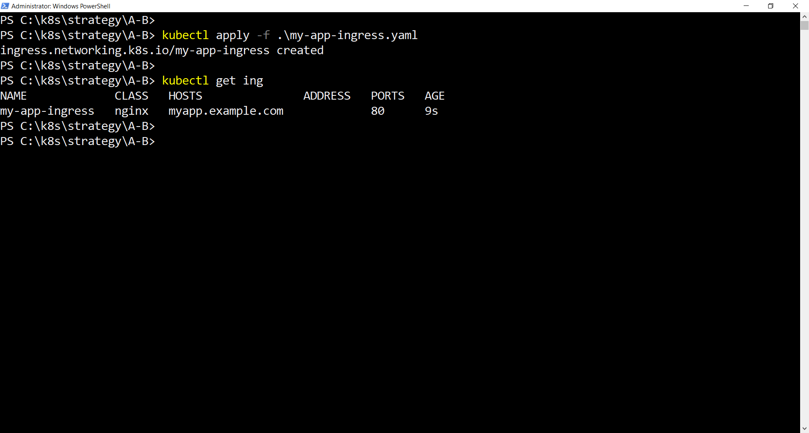
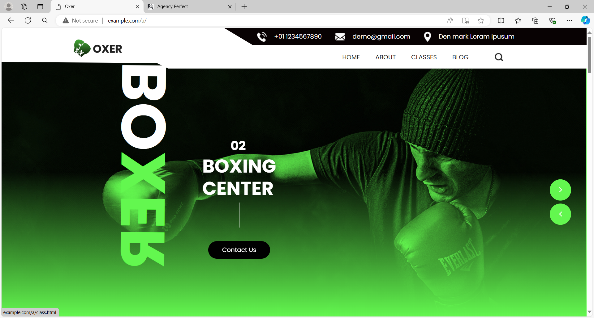
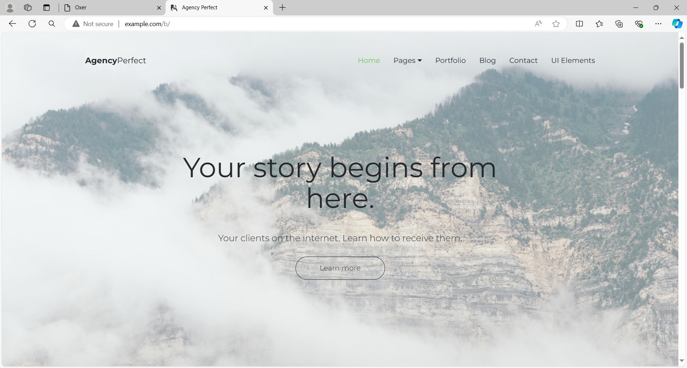

# A/B Testing Strategy in Kubernetes

This guide explains how to implement an A/B Testing strategy in Kubernetes. A/B Testing involves deploying two or more versions of an application and routing traffic to each version based on specific criteria, such as user attributes, to evaluate which version performs better.

## Introduction

A/B Testing, also known as split testing, is a method of comparing two versions of a webpage or application to determine which one performs better. This approach helps to make data-driven decisions by testing different variations and analyzing their impact on user behavior and performance metrics.

## How A/B Testing Works

1. **Define Goals**: Determine what metrics or goals you want to test. For example, increasing click-through rates or improving user engagement.
2. **Create Variants**: Develop two or more variations of the page or feature you want to test.
3. **Split Traffic**: Use a tool or strategy to randomly assign users to different versions.
4. **Collect Data**: Gather data on how each variant performs against the defined goals.
5. **Analyze Results**: Compare the performance of each variant to identify which one is more effective.
6. **Implement Findings**: Deploy the best-performing version based on the results of the test.

## ConfigMap Usage for A/B Testing

In this project, we used a ConfigMap to modify the `default.conf` file of our NGINX configuration. The ConfigMap allows us to customize how traffic is routed to different paths within the container image. This setup is crucial for implementing A/B Testing by directing traffic to different versions of the application.

### Steps to Configure

1. **Create a ConfigMap**:
   - Define a ConfigMap that includes the custom `default.conf` configuration. This file contains routing rules to direct traffic based on the A/B Testing setup.

2. **Update `default.conf`**:
   - The `default.conf` file is modified to include specific routing rules. For instance, you can configure different paths to point to different versions of the application.

3. **Use ConfigMap in Deployment**:
   - The ConfigMap is used in the Kubernetes deployment as a volume. This ensures that the NGINX container uses the updated configuration to handle traffic according to the A/B Testing strategy.

[Here](a-nginx-config.yaml) is an example of how the ConfigMap are defined in the Kubernetes.

## Version A and Version B Deployments

We will create two deployments: one for Version A and one for Version B of the application.

### [Version A Deployment](a-version.yaml)

```yaml
apiVersion: apps/v1
kind: Deployment
metadata:
  name: version-a-deployment
  labels:
    app: my-app
    version: a
spec:
  replicas: 3
  selector:
    matchLabels:
      app: my-app
      version: a
  template:
    metadata:
      labels:
        app: my-app
        version: a
    spec:
      containers:
      - name: my-app
        image: seyma1km/oxer-html
        volumeMounts:
        - name: a-nginx-config-volume
          mountPath: /etc/nginx/conf.d/default.conf
          subPath: default.conf
      volumes:
      - name: a-nginx-config-volume
        configMap:
          name: a-nginx-config
```

### [Version B Deployment](b-version.yaml)

```yaml
apiVersion: apps/v1
kind: Deployment
metadata:
  name: version-b-deployment
  labels:
    app: my-app
    version: b
spec:
  replicas: 3
  selector:
    matchLabels:
      app: my-app
      version: b
  template:
    metadata:
      labels:
        app: my-app
        version: b
    spec:
      containers:
      - name: my-app
        image: seyma1km/angency-perfect
        volumeMounts:
        - name: b-nginx-config-volume
          mountPath: /etc/nginx/conf.d/default.conf
          subPath: default.conf
      volumes:
      - name: b-nginx-config-volume
        configMap:
          name: b-nginx-config
```

## Services for A/B Testing

To route traffic to each version of the application, we create two separate services: one for Version A and one for Version B.
I used the kubectl expose command to create a service from the deployment.

Below is how to write the `kubectl expose` command and create a pod using `kubectl apply`:



## Verify Services and Pods Status



## Ingress for A/B Testing

To manage routing traffic between the two versions, we set up an Ingress resource with rules to split traffic or direct it based on specific criteria, such as headers or cookies.

### [Ingress Configuration](my-app-ingress.yaml)

```yaml
apiVersion: networking.k8s.io/v1
kind: Ingress
metadata:
  name: my-app-ingress
  namespace: default
spec:
  rules:
  - host: example.com
    http:
      paths:
      - path: /a
        backend:
          service:
            name: version-a-deployment
            port:
              number: 80
        pathType: ImplementationSpecific
      - path: /b
        backend:
          service:
            name: version-b-deployment
            port:
              number: 80
        pathType: ImplementationSpecific
```

#### Applying the Configuration



### How It Works

- **Version A**: Traffic directed to `myapp.example.com/a` is routed to Version A of the application via `version-a-service`.
- **Version B**: Traffic directed to `myapp.example.com/b` is routed to Version B of the application via `version-b-service`.

#### Version A in Browser



#### Version B in Browser



Alternatively, you can route traffic based on headers, cookies, or other criteria to simulate real-world A/B testing scenarios. This can be achieved using annotations or more complex Ingress configurations.

## Monitoring and Evaluation

During the A/B testing period, monitor the performance of both versions (A and B) using metrics, logs, or user feedback. After collecting enough data, you can decide which version performs better and either promote it to all users or continue testing with other versions.
