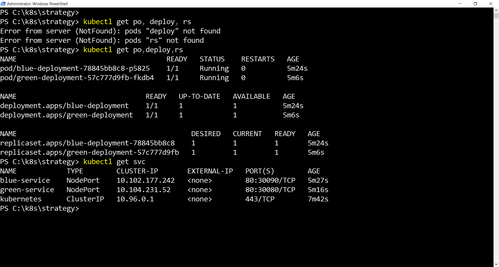
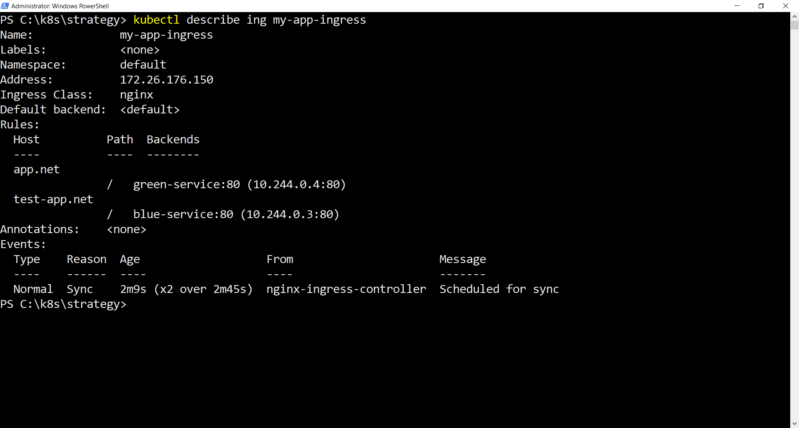
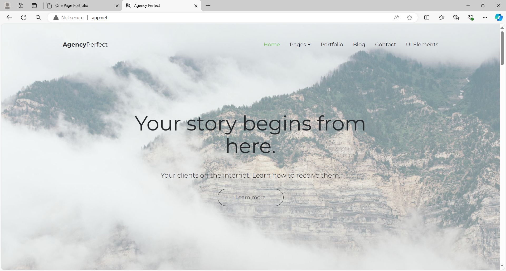

# Green-Blue Deployment Strategy in Kubernetes

This guide explains how to implement a Green-Blue Deployment strategy in Kubernetes. Green-Blue Deployment allows you to run two versions of your application (Green and Blue) simultaneously, enabling seamless transitions between versions without downtime.

## 1. Green and Blue Deployments

We will create two deployments: one for the Green version and one for the Blue version of the application.

### [Green Deployment](green-app.yaml)

```yaml
apiVersion: apps/v1
kind: Deployment
metadata:
  name: green-deployment
  labels:
    app: my-app
    version: green
spec:
  replicas: 1
  selector:
    matchLabels:
      app: my-app
      version: green
  template:
    metadata:
      labels:
        app: my-app
        version: green
    spec:
      containers:
      - name: my-app
        image: seyma1km/angency-perfect
        ports:
        - containerPort: 80
```

### [Blue Deployment](blue-app.yaml)

```yaml
apiVersion: apps/v1
kind: Deployment
metadata:
  name: blue-deployment
  labels:
    app: my-app
    version: blue
spec:
  replicas: 1
  selector:
    matchLabels:
      app: my-app
      version: blue
  template:
    metadata:
      labels:
        app: my-app
        version: blue
    spec:
      containers:
      - name: my-app
        image: seyma1km/one-page-html
        ports:
        - containerPort: 80
```

## 2. Services for Green and Blue

To route traffic to the correct version of the application, we create two services: one for Green and one for Blue.

### [Green Service](green-svc.yaml)

```yaml
apiVersion: v1
kind: Service
metadata:
  name: green-service
spec:
  type: NodePort
  selector:
    app: my-app
    version: green
  ports:
    - port: 80
      targetPort: 80
      nodePort: 30080
```

### [Blue Service](blue-svc.yaml)

```yaml
apiVersion: v1
kind: Service
metadata:
  name: blue-service
spec:
  type: NodePort
  selector:
    app: my-app
    version: blue
  ports:
  - protocol: TCP
    port: 80
    targetPort: 80
    nodePort: 30090
```

## Verify Services and Pods Status



## 3. Ingress for Green-Blue Deployment

To manage routing traffic between the Green and Blue versions using different hostnames, we set up an Ingress resource.

### [Ingress Configuration](app-ingress.yaml)

```yaml
apiVersion: networking.k8s.io/v1
kind: Ingress
metadata:
  name: my-app-ingress
  namespace: default
spec:
  rules:
  - host: app.net
    http:
      paths:
      - pathType: ImplementationSpecific
        path: /
        backend:
          service:
            name: green-service
            port:
              number: 80
  - host: test-app.net
    http:
      paths:
      - pathType: ImplementationSpecific
        path: /
        backend:
          service:
            name: blue-service
            port:
              number: 80
```

### How It Works

- **Green Version**: Traffic to `app.net` is routed to the Green version of the application via `green-service`.
- **Blue Version**: Traffic to `test-app.net` is routed to the Blue version of the application via `blue-service`.

### Verify Ingress Status

To verify the status of Ingress, I used the `kubectl describe` command, as shown in the image below:



## Green App in Browser



## Blue App in Browser


## 5. Traffic Switching

Once you are confident that the Blue version is stable, you can switch all traffic to the Blue version by updating the Ingress resource to point `app.net` to `blue-service` instead of `green-service`.
