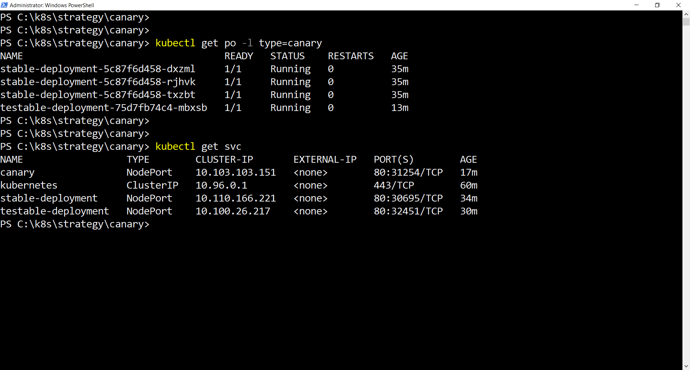
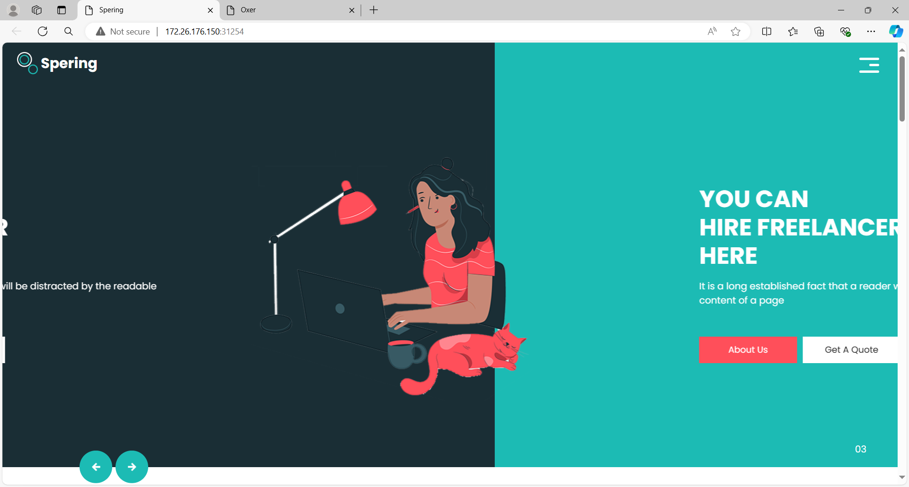
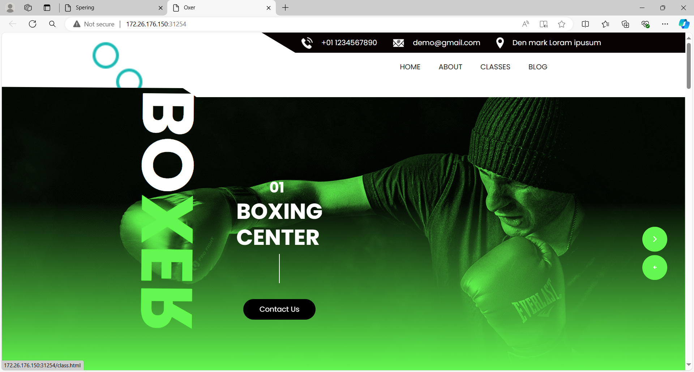

# Canary Deployment in Kubernetes

This guide explains how to implement a Canary Deployment strategy in Kubernetes. Canary Deployment allows you to release a new version of your application to a small subset of users before rolling it out to the entire user base. This approach helps in identifying issues with the new release without affecting the majority of users.

## 1. Stable and Canary Deployments

We will create two deployments: one for the stable version and one for the testable version of the application.

### [Stable Deployment](stable.yaml)

```yaml
apiVersion: apps/v1
kind: Deployment
metadata:
  name: stable-deployment
  labels:
    app: stable-app
spec:
  replicas: 3
  selector:
    matchLabels:
      app: stable-app
  template:
    metadata:
      labels:
        app: stable-app
        type: canary
    spec:
      containers:
      - name: stable-app
        image: seyma1km/spering-html 
        ports:
        - containerPort: 80
```

### [Testable Deployment](testable.yaml)

```yaml
apiVersion: apps/v1
kind: Deployment
metadata:
  name: testable-deployment
  labels:
    app: testable-app
spec:
  replicas: 1
  selector:
    matchLabels:
      app: testable-app
  template:
    metadata:
      labels:
        app: testable-app
        type: canary
    spec:
      containers:
      - name: testable-app
        image: seyma1km/oxer-html
        ports:
        - containerPort: 80
```

## 2. Service for Canary Deployment

To route traffic to both the stable and canary versions, we create a single service that targets both deployments.

### [Service Configuration](canary-svc.yaml)

```yaml
apiVersion: v1
kind: Service
metadata:
  creationTimestamp: null
  labels:
    type: canary
  name: canary
spec:
  ports:
  - port: 80
    protocol: TCP
    targetPort: 80
  selector:
    type: canary
  type: NodePort
status:
  loadBalancer: {}
```

You can also create this service using the `kubectl expose` command as follows:

```sh
kubectl expose deployment stable-deployment --name canary --type=NodePort --dry-run=client -o yaml > canary-svc.yaml
```

Then, update the `canary-svc.yaml` file (was created using the previous command) by modifying the `selector` field to:

```yaml
  selector:
    type: canary
```

## 3. Applying the Configuration

To apply the configurations, use the following commands:

```bash
kubectl apply -f stable-deployment.yaml
kubectl apply -f testable-deployment.yaml
kubectl apply -f canary-svc.yaml         #After modification
```

## 4. Verify Services and Pods Status



## Stable Version in Browser



## Testable Version in Browser



## 5. Gradual Rollout

If the testable version is stable and performs as expected, you can gradually increase the traffic directed to it by increasing the number of replicas for this version. Once confident, you can roll out the testable version to 100% of users by scaling down the stable deployment or redirecting all traffic to the testable deployment.
